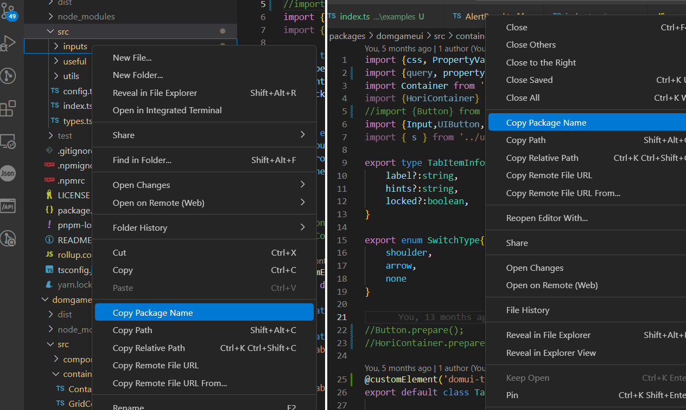

# Package Name Copier

Package Name Copier is a lightweight VS Code extension designed for monorepo projects. It adds a **Copy package name** button to both the file tab and the explorer context menu, allowing you to quickly copy the nearest `package.json`'s `name` field to your clipboard.

## Features

- **Copy Package Name Button:** Easily accessible on the file tab and explorer context menu.
- **Nearest package.json Detection:** Automatically finds the closest `package.json` file and copies its `name` field.
- **Monorepo Friendly:** Optimized for projects with multiple package files.

## Demo

Check out the extension in action:

## Installation

1. Open VS Code.
2. Go to the Extensions view by pressing `Ctrl+Shift+X` (or `Cmd+Shift+X` on macOS).
3. Search for **Package Name Copier**.
4. Click **Install**.

## Usage

1. Open any file in your project.
2. Click the **Copy package name** button on the file tab or right-click in the Explorer context menu.
3. The extension will locate the nearest `package.json` and copy the value of its `name` field to your clipboard.

## Requirements

- Visual Studio Code version 1.x or higher.

## GitHub

For more details, bug reports, and contribution guidelines, please visit my [GitHub repository](https://github.com/Hocti/package-name-copier).

## License

This project is licensed under the MIT License.
